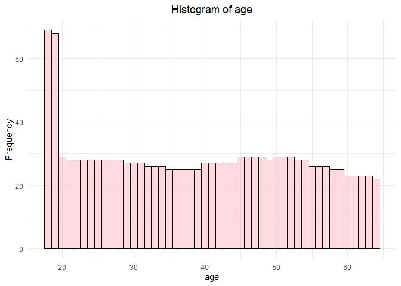
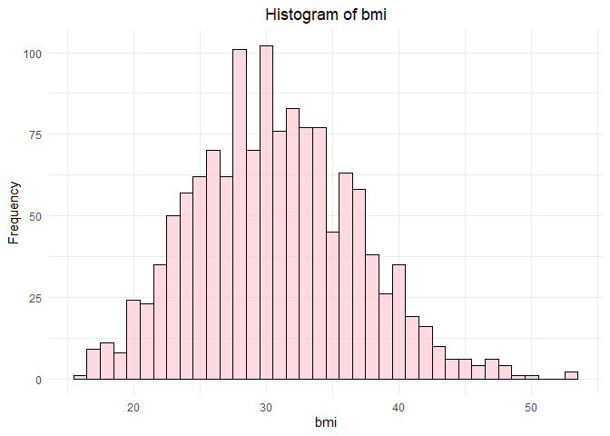
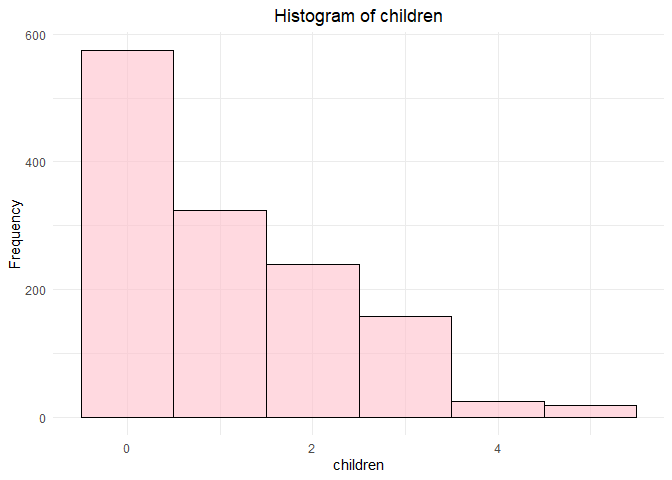
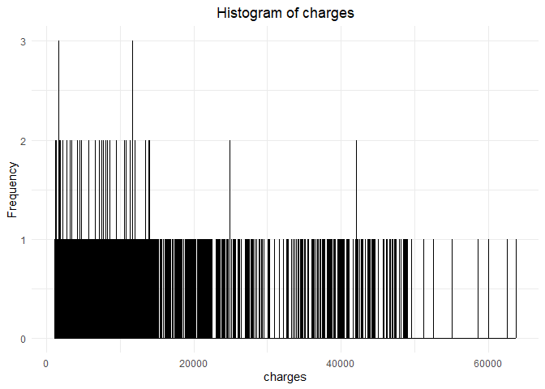

Data Visualisation part 1
================
Polina Burmakina
2023-11-6

## Задание №1

Прочитаем данные и выведем сводку

``` r
insurance <- read.csv('data/raw/insurance_cost.csv')
summary(insurance)
```

    ##       age            sex                 bmi           children    
    ##  Min.   :18.00   Length:1338        Min.   :15.96   Min.   :0.000  
    ##  1st Qu.:27.00   Class :character   1st Qu.:26.30   1st Qu.:0.000  
    ##  Median :39.00   Mode  :character   Median :30.40   Median :1.000  
    ##  Mean   :39.21                      Mean   :30.66   Mean   :1.095  
    ##  3rd Qu.:51.00                      3rd Qu.:34.69   3rd Qu.:2.000  
    ##  Max.   :64.00                      Max.   :53.13   Max.   :5.000  
    ##     smoker             region             charges     
    ##  Length:1338        Length:1338        Min.   : 1122  
    ##  Class :character   Class :character   1st Qu.: 4740  
    ##  Mode  :character   Mode  :character   Median : 9382  
    ##                                        Mean   :13270  
    ##                                        3rd Qu.:16640  
    ##                                        Max.   :63770

Сделаем некоторые преобразования и посмотрим, что получилось

``` r
insurance <- insurance %>% mutate_if(is.numeric, ~ round(., 0)) %>% mutate(across(c(sex, smoker, region), ~ as.factor(.x)))
summary(insurance)
```

    ##       age            sex           bmi           children     smoker    
    ##  Min.   :18.00   female:662   Min.   :16.00   Min.   :0.000   no :1064  
    ##  1st Qu.:27.00   male  :676   1st Qu.:26.00   1st Qu.:0.000   yes: 274  
    ##  Median :39.00                Median :30.00   Median :1.000             
    ##  Mean   :39.21                Mean   :30.66   Mean   :1.095             
    ##  3rd Qu.:51.00                3rd Qu.:35.00   3rd Qu.:2.000             
    ##  Max.   :64.00                Max.   :53.00   Max.   :5.000             
    ##        region       charges     
    ##  northeast:324   Min.   : 1122  
    ##  northwest:325   1st Qu.: 4740  
    ##  southeast:364   Median : 9382  
    ##  southwest:325   Mean   :13270  
    ##                  3rd Qu.:16640  
    ##                  Max.   :63770

## Задание №2

``` r
for (col in names(insurance)) {
  if (is.numeric(insurance[[col]])) {
    hists <- ggplot(insurance, aes(x = insurance[[col]])) +
      geom_histogram(binwidth = 1, fill = "pink", color = "black", alpha = 0.6) +
      labs(title = paste("Histogram of", col),
           x = col, y = "Frequency") +
      theme_minimal() +
      theme(plot.title = element_text(hjust = 0.5))
     print(hists)
  }
}
```
datavis_pic/HW1/unnamed-chunk-12-1.png
<!-- --><!-- --><!-- --><!-- -->

Гистограммы по количеству детей выглядит нормально, по ИМТ и возрасту -
сносно, чего не скажешь о гистограмме по затратам. Её нужно настраивать
отдельно или визуализировать другим способом.Улучшить картину по
стоимости страховки поможет изменение параметра *binwidth*, который
определяет ширину столбца на гистограмме.Это параметр влияет на
гладкость и детализацию гистограммы.Попробуем улучшить гистограмму ИМТ и
возраста, построив ее не по всем данным, а по общепринятым “интервалам”

``` r
ggplot(data = insurance, 
       aes(x = charges)) +
  geom_histogram(binwidth = 1250, fill = "green", color = "black", alpha = 0.65) +
      labs(title = paste("Histogram of", col),
           x = col, y = "Frequency")
```

<!-- -->

``` r
# Преобразование переменной age в категориальную age_group
insurance <- insurance %>% 
  mutate(age_group = case_when(
    age <= 20 ~ "18-20",
    age > 20 & age < 35 ~ "21-34",
    age >= 35 & age < 50 ~ "35-49",
    age >= 50 ~ "50+"))

# Гистограмма по возрастным группам
ggplot(data = insurance, aes(x = age_group)) +
  geom_bar(fill = "blue", color = "black", alpha = 0.55) +
  labs(title = "Histogram of Age Groups",
       x = "Age Group",
       y = "Frequency") + 
  theme_classic()
```

<!-- -->

``` r
# Преобразование переменной bmi в категориальную bmi_group 
insurance <- insurance %>% 
  mutate(bmi_group = case_when(
   bmi < 18 ~ "Underweight",
   bmi >= 18 & bmi <= 24 ~ "Normal",
   bmi >= 25 & bmi <30 ~ "Overweight",
   bmi >= 30 ~ "Obesity"))

# Гистограмма по группам ИМТ
ggplot(data = insurance, aes(x = bmi_group)) +
  geom_bar(fill = "orange", color = "black", alpha = 0.55) +
  labs(title = "Histogram of BMI Groups",
       x = "BMI Group",
       y = "Frequency") +
  theme_classic()
```

<!-- -->

## Задание №3

Построим график плотности по колонке *charges*

``` r
charges_density <- ggplot(data = insurance, aes(x = charges)) +
  geom_density(alpha = 0.65) +
 geom_vline(aes(xintercept = mean(charges), color = "Mean"), linewidth = 1) +
  geom_vline(aes(xintercept = median(charges), color = "Median"), linewidth = 1)+
  geom_text(aes(x = mean(charges), y = 0.00005, label = paste(round(mean(charges), 2))),
            color = "red", vjust = 1, size = 3, nudge_x = 3600) +
  geom_text(aes(x = median(charges), y = 0.00004, label = paste(round(median(charges), 2))),
            color = "blue", vjust = -1, size = 3, nudge_x = -2500) +
  scale_color_manual(values = c("Mean" = "red", "Median" = "blue")) +
  labs(x = "Charges",
       y = "Density") +
  theme_classic()
charges_density
```

<!-- -->

## Задание №4

``` r
  charges_by_sex <- ggplot(data = insurance, aes(x = sex, y = charges, fill = sex)) +
  geom_boxplot() +
  labs(x = "Charges",
       y = "Density") +
  theme_classic()
  charges_by_sex
```

<!-- -->

``` r
charges_by_smokers <- ggplot(data = insurance, aes(x = smoker, y = charges, fill = smoker)) +
  geom_boxplot() +
  labs(x = "Charges",
       y = "Density") +
  theme_classic()
charges_by_smokers
```

<!-- -->

``` r
charges_by_regions <- ggplot(data = insurance, aes(x = region, y = charges, fill = region)) +
  geom_boxplot() +
  labs(x = "Charges",
       y = "Density") +
  theme_classic()
charges_by_regions
```

<!-- -->

## Задание №5

Объединим графики из предыдущих заданий:

``` r
combine_plot <- ggarrange(
  charges_density,
  ggarrange(charges_by_sex, charges_by_smokers, charges_by_regions, ncol = 3),
  heights = c(3, 1),  # 3 строки для charges_density, 1 строка для 3 графиков
  ncol = 1
) + labs(title = "Charges density and boxplots for different parameters")

# Уменьшение размеров подписей осей
combine_plot <- combine_plot +
  theme(axis.text = element_text(size = 6),
        axis.title = element_text(size = 6),
        plot.title = element_text(size = 12))

combine_plot
```

<!-- -->

## Задание №6

Фасет для боксплота по регионам

``` r
charges_by_regions_faceted <- charges_by_regions +
  facet_wrap(~ region, scales = "free_y")

charges_by_regions_faceted
```

<!-- -->

## Задание №7-8

Scatter plot отношения возраста и стоимости страховки имеeт вид:

``` r
scatter_age <- insurance %>% 
  ggplot(aes(x = age, y = charges, color = age_group)) +  
  geom_point(size = 2.5) +
  geom_smooth(method = "lm", se = T, color = "black") +  # Добавляем линию тренда
  labs(title = "Charges vs ages", x = "Age", y = "Charges") +
  theme_classic() +
theme( axis.title.x = element_text(size=14), axis.title.y = element_text(size=14))
scatter_age
```

    ## `geom_smooth()` using formula = 'y ~ x'

<!-- -->

## Задание №9

Проведем тренд у курящих и некурящих людей

``` r
scatter_age_smoker <- insurance %>% 
  ggplot(aes(x = age, y = charges, color = smoker)) +
  geom_point(size = 2.5) +
  geom_smooth(
    aes(group = smoker, fill = smoker),
    method = "lm",
    se = T,
    linetype = "solid",
    color = "black"
  )  +

  labs(title = "Charges vs ages", x = "Age", y = "Charges") +
  theme_classic() +
  theme(axis.title.x = element_text(size = 14), axis.title.y = element_text(size = 14))

scatter_age_smoker
```

    ## `geom_smooth()` using formula = 'y ~ x'

<!-- -->

## Задание №10

Провернем предыдущие шаги (7-9) для ИМТ

``` r
scatter_bmi <- insurance %>% 
  ggplot(aes(x = bmi, y = charges, color = bmi_group)) +  
  geom_point(size = 2.5) +
  geom_smooth(method = "lm", se = T, color = "black") +  # Добавляем линию тренда
  labs(title = "Charges vs BMI", x = "BMI", y = "Charges") +
  theme_classic() +
theme( axis.title.x = element_text(size=14), axis.title.y = element_text(size=14))
scatter_bmi
```

    ## `geom_smooth()` using formula = 'y ~ x'

<!-- -->

``` r
scatter_bmi_smoker <- insurance %>% 
  ggplot(aes(x = bmi, y = charges, color = smoker)) +
  geom_point(size = 2.5) +
  geom_smooth(
    aes(group = smoker, fill = smoker),
    method = "lm",
    se = T,
    linetype = "solid",
    color = "black"
  )  +

  labs(title = "Charges vs BMI", x = "BMI", y = "Charges") +
  theme_classic() +
  theme(axis.title.x = element_text(size = 14), axis.title.y = element_text(size = 14))

scatter_bmi_smoker
```

    ## `geom_smooth()` using formula = 'y ~ x'

<!-- -->

## Задание № 14

``` r
insurance$log_charges <- log(insurance$charges)

ggplot(data = insurance, aes(x = bmi, y = log_charges)) +
  geom_count(aes(color = ..n..), size = 2, alpha = 0.4) +
  geom_smooth(method = "lm", se = T, linetype = "solid", size = 1) +
  scale_color_viridis_c() +  
  labs(title = "BMI vs Log(Charges) for each age group", x = "BMI", y = "log(charges)") +
  theme_minimal() +
  facet_wrap(~age_group)
```

    ## `geom_smooth()` using formula = 'y ~ x'

<!-- -->
