Data visualisation part 2
================
Polina Burmakina
2023-11-15

## Задание №1

``` r
led <- read_rds("~/data/raw/life_expectancy_data.RDS")
```

## Задание №2

``` r
plot_ly(data = led[(led$'Clean fuels and cooking technologies' != 0) & (led$'Per Capita' != 0),],
        x = ~ `Clean fuels and cooking technologies`,
        y = ~ `Per Capita`,
        color = ~ continent,
        type = 'scatter',
        mode = 'markers')
```

    ## PhantomJS not found. You can install it with webshot::install_phantomjs(). If it is installed, please make sure the phantomjs executable can be found via the PATH variable.

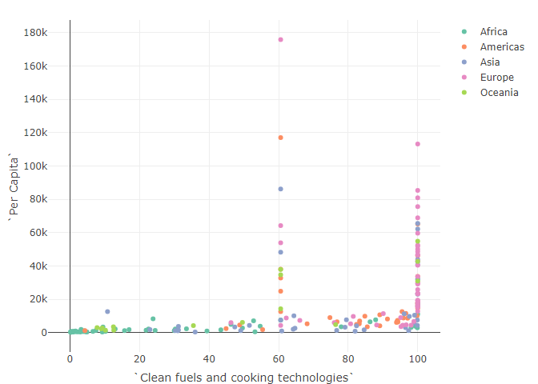<!-- -->

## Задание №3

Проведем *t-test* c использованием **rstatix** :

``` r
# выберем числовые переменные
filtered_led <- led %>% 
  filter(continent %in% c("Africa", "Americas"))

# выведем qqplot
ggqqplot(filtered_led, 
         x = 'Life expectancy')
```

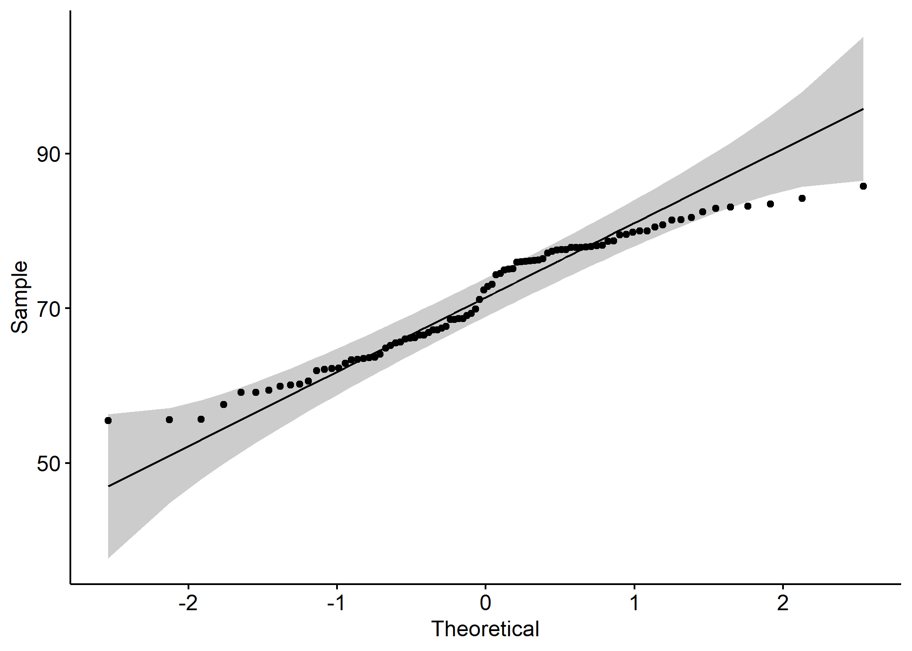<!-- -->

``` r
# проведем t-test
stat.test <- filtered_led %>% 
  t_test(`Life expectancy` ~ continent) %>%  # Use backticks around the column name
  add_xy_position(x = 'continent')
stat.test
```

    ## # A tibble: 1 × 12
    ##   .y.       group1 group2    n1    n2 statistic    df        p y.position groups
    ##   <chr>     <chr>  <chr>  <int> <int>     <dbl> <dbl>    <dbl>      <dbl> <name>
    ## 1 Life exp… Africa Ameri…    52    38     -12.3  85.8 1.31e-20       86.6 <chr> 
    ## # ℹ 2 more variables: xmin <dbl>, xmax <dbl>

``` r
# визуализируем
my_pal <- c("lightyellow", "lightcoral")
 
ggboxplot(filtered_led, 
          x = 'continent', y = 'Life expectancy',  # Remove extra single quotes
          ylab = "Life expectancy", xlab = "Continent", fill = 'continent', palette = my_pal,
          add = "jitter") + 
  labs(subtitle = get_test_label(stat.test, detailed = TRUE)) + 
  stat_pvalue_manual(stat.test, tip.length = 0) +
  theme_minimal()
```

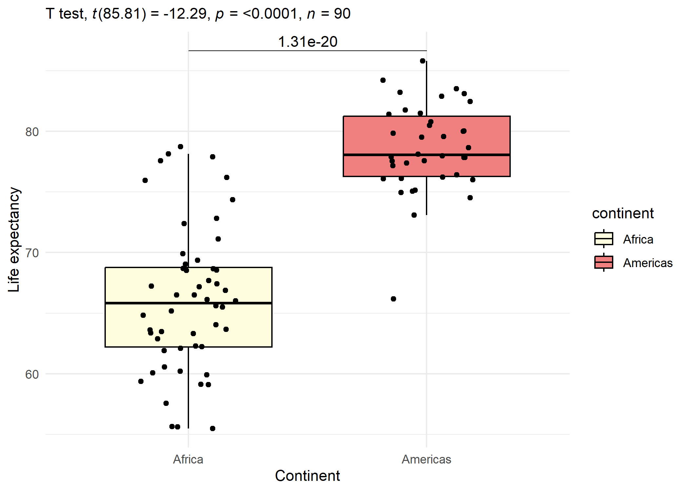<!-- -->

## Задание №4

Корреляционный анализ датасета

``` r
# возьмем только numeric
led_nums <- led %>% select_if(is.numeric) %>% select(- Year)
scaled_led <- scale(led_nums)
led_cor <- cor(scaled_led) 

# 1й график с помощью пакета *corrplot*
color_palette <- colorRampPalette(rev(RColorBrewer::brewer.pal(10, "RdYlBu")))(100)
corrplot(led_cor, method = "color", type = "lower", order = "hclust", tl.col = "black", tl.srt = 45, tl.cex = 0.7, col = color_palette)
```

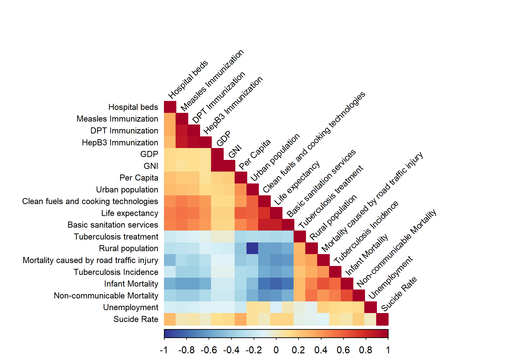<!-- -->

``` r
# 2й график с помощью пакета *corrr*
led_cor %>% 
  rplot() + theme( axis.text.x = element_text(angle = 45, vjust = 1, hjust =1))
```

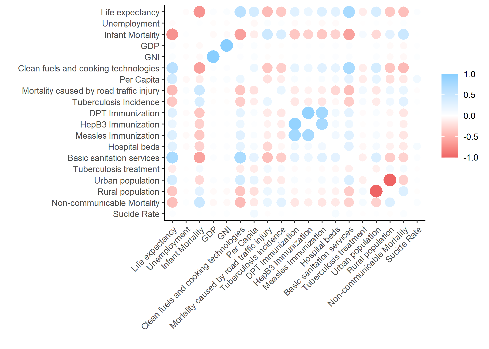<!-- -->

## Задание №5

Сделаем дендрограммный график методом иерархической кластеризации

``` r
column_labels <- colnames(scaled_led)

led_dist <- dist(scaled_led, method = "euclidean")
led_hc <- hclust(d = led_dist, method = "ward.D2")

fviz_dend(
  led_hc,
  cex = 0.1,
  horiz = F)
```

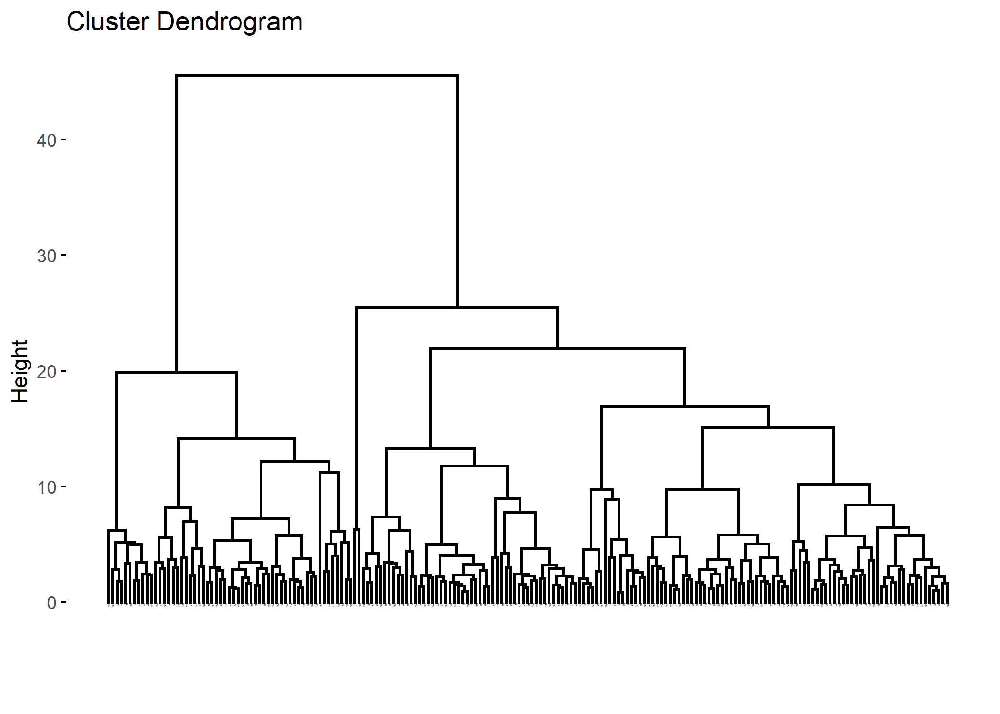<!-- -->
\## Задание №6 \* Объединяя дендрограмму и тепловую карту, можно сделать
о данных какие-то предположения. Наибольшая ~~теплота~~ видна в кластере
с валовым внутренним и национальным продуктами, которые стоят в данных
особняком, возможно, на них далее особого внимания обращать не стоит. \*
Более содержательными/логичными выглядят другие кластеры (которые еще
лучше видны на треугольной тепловой карте выше) - кластер с несколькими
видами вакцинации и кластер, объединяющий продолжительность жизни +
городское население + доступность медицинской помощи, технологий,
продуктов питания. \* Остается кластер со “всем остальным” - лечением
туберкулеза, смертностью и безработицей, в котором тоже присутствует
логика \* Ощущается недостаток метода - необходимость самостоятельно
подбирать количество кластеров,что не очень просто сделать основываясь
на ~~предположениях~~ (у меня количество кластеров наугад) \* График
будто бы пересыщен информацией, которую не очень просто и удобно читать,
без уменьшения размерности никак не обойтись

``` r
pheatmap(scaled_led, 
         show_rownames = T, 
         clustering_distance_rows = led_dist,
         clustering_method = "ward.D2", 
         cutree_rows = 4,
         cutree_cols = length(colnames(scaled_led)),
         angle_col = 45, 
         main = "Dendrograms for clustering rows and columns with heatmap")
```

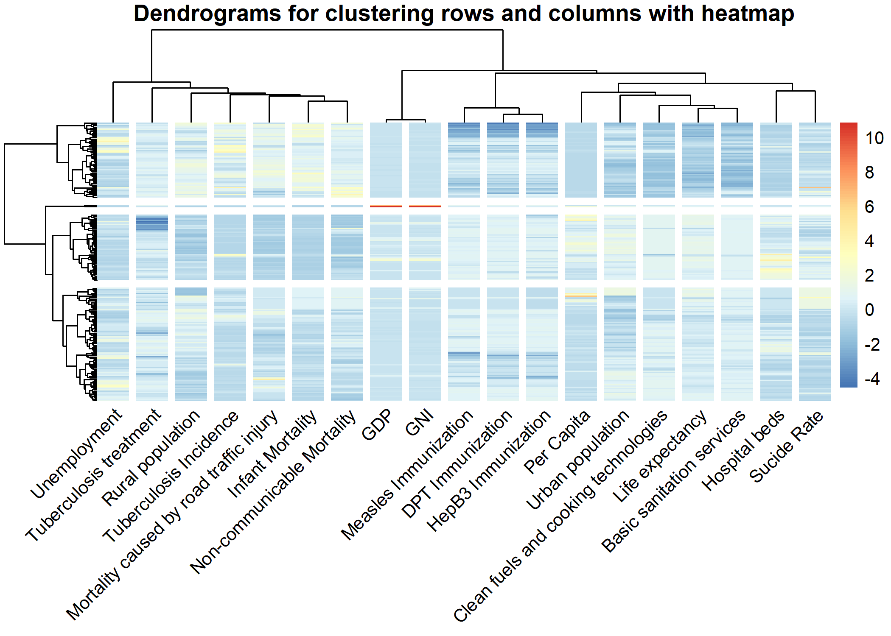<!-- -->
\## Задание №7-9 Проведем анализ главных компонент

``` r
led.pca <- prcomp(scaled_led)
summary(led.pca)
```

    ## Importance of components:
    ##                           PC1    PC2    PC3     PC4     PC5     PC6    PC7
    ## Standard deviation     2.7526 1.4841 1.3952 1.17177 1.08375 0.96347 0.9288
    ## Proportion of Variance 0.3988 0.1159 0.1025 0.07227 0.06182 0.04886 0.0454
    ## Cumulative Proportion  0.3988 0.5147 0.6172 0.68945 0.75126 0.80012 0.8455
    ##                            PC8     PC9    PC10    PC11    PC12    PC13    PC14
    ## Standard deviation     0.85740 0.69263 0.68937 0.59106 0.54986 0.47085 0.36596
    ## Proportion of Variance 0.03869 0.02525 0.02501 0.01839 0.01591 0.01167 0.00705
    ## Cumulative Proportion  0.88421 0.90946 0.93447 0.95286 0.96877 0.98044 0.98749
    ##                           PC15    PC16    PC17    PC18      PC19
    ## Standard deviation     0.34546 0.26941 0.20224 0.06968 1.012e-15
    ## Proportion of Variance 0.00628 0.00382 0.00215 0.00026 0.000e+00
    ## Cumulative Proportion  0.99377 0.99759 0.99974 1.00000 1.000e+00

У нас много переменных - целых 19, без учета переменных другого типа, а
более 75% картины, судя по *Cumulative Proportion*, можно получить,
используя первые 5. Наиболее информативные - даже первые 3, вклад
остальных - менее 10%.

``` r
fviz_eig(led.pca, addlabels = T, ylim = c(0, 40))
```

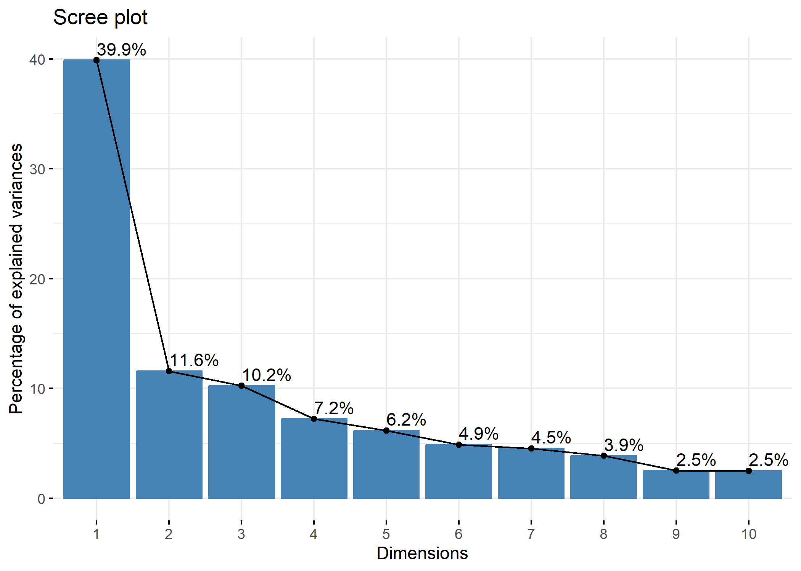<!-- -->

Выведем эти 5 компонент. Картина получается вроде: \* продолжительность
жизни увеличивается с какой-то “долей” пропорции вакцинацией \[жизнь\]
\* \[смерть\] изменяется обратнопропорционально - что как бы тянет вниз
продолжительность жизни и логично вытекает из “отсутствия” вакцинации

``` r
fviz_pca_var(led.pca, col.var = "contrib", select.var = list(contrib = 5))
```

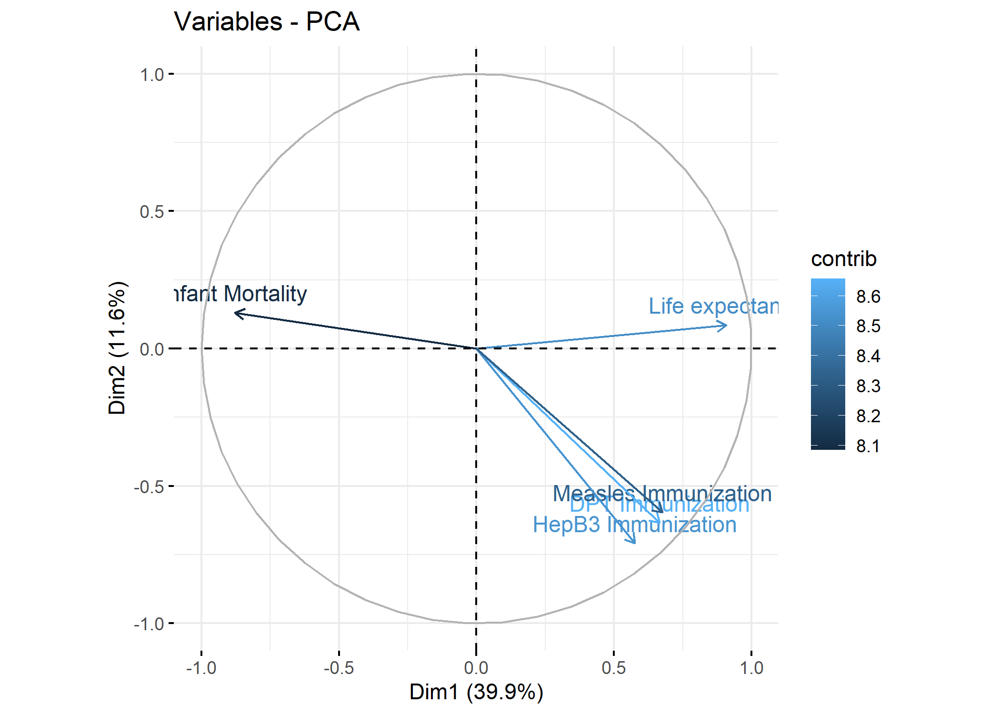<!-- -->
P.S. мои попытки вывести на biplot снова только 5 компонент успехом не
увенчались( буду рада комментарию/совету по тому, как можно это сделать

``` r
plot <- ggbiplot(led.pca, 
                 #select.var = list(contrib = 5),col.var = "contrib",
                 #choices = 1:5, 
                 scale = 0,
                 groups = as.factor(led$continent),
                 color = as.factor(led$continent),
                 ellipse = TRUE, 
                 alpha = 0.2,
                 palette = viridis::viridis_pal()) +  # Используем цветовую палитру Viridis
  theme_minimal()
plot
```

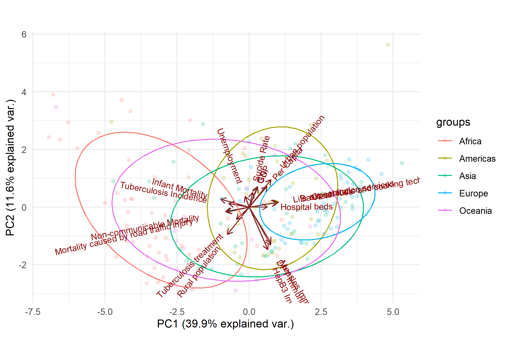<!-- -->

``` r
biplot_plotly <- ggplotly(plot)

biplot_plotly <- biplot_plotly %>%
  add_trace(
    type = "scatter",
    mode = "markers",
    x = led.pca$x[, 1],
    y = led.pca$x[, 2],
    hoverinfo = "text",
    text = led$Country,
    marker = list(color = as.factor(led$continent)),
    showlegend = F,  # Скрываем легенду для данного следа
    source = "source"   # Указываем источник данных
  )

biplot_plotly
```

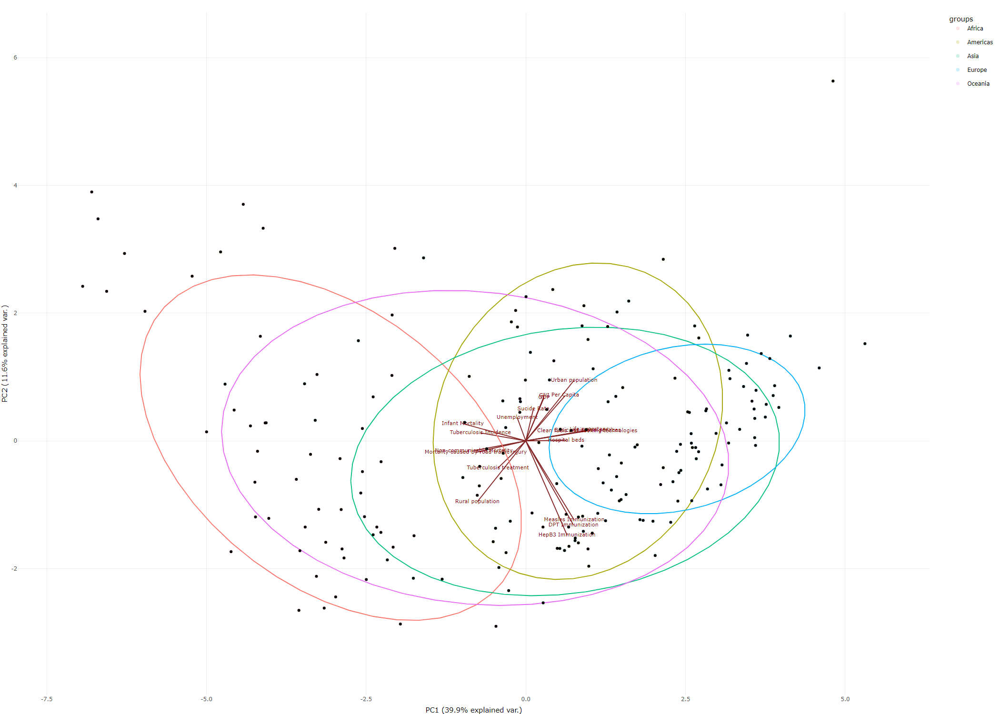<!-- -->
Такой график дает много информации, на нем видны какие-то общеизвестные
тенденции и его инересно рассматривать. Попробую привести примеры, но их
список конечно же далеко не полный (в виду моей ненасмотренности в
каких-то “геополитических” и других темах) \* Длинная стрелка вверх в
“эконочимеских” показателях - ввп на душу населения - стремится в
Америку (забавно и примечательно, что стретка суицида - тоже); \*
“Проблемные” стрелки вроде смертности, туберкулеза и безработицы
перетягивается наблюдениямми из Африки; \* Стлелочки, ассициированные с
“ростом” технологий, продолжительности жизни, уровнем медицинской
помощь - в Европейской части; \* Азиатские страны где-то между Европой и
Америкой;

## Задание №11

Повторим анализ главных компонент на уменьшенном датасете несколько раз.
\* На наших данных pca не очень хорош, потому что 2-3 компонент не
достаточно. На 14 столбцах в 2 из 3 ~~экспериментах~~ можно остановиться
на 4 главных компонентах, то есть, уменьшив примерно на четверть данные
мы пришли к количеству компонент на 1/5 меньше чем вначале. \* У меня в
главные компоненты все разы вышла смертность, продолжительность
жизни/что-то другое из (благоприятного) кластера, в качестве оставшихся
составляющих попал кластер с ввп/внп, а на другой - кластер с
вакцинацией. МОжно сделать вывод о том, что количество кластеров,
окторое я до этого пыталась выделить, не так уж и плохо - все они
представлены в “информативных” компонентах. \* Первый и второй biplots
очень похожи, но как-то перевернуты сверху вниз, а вот третий -
отличается (в него не вошла как минимум продолжительность жизни из
важного). Можно заключить, что метод не очень стабильный/устойчивый.

``` r
# Установка зерна случайности для воспроизводимости 
set.seed(123)

# сделаем 3 уменьшенных на 5 столбцов датасета
rand_led_1 <- rand_led_2 <- rand_led_3 <- NULL

for (i in 1:3) {
  cols_to_keep <- sample(colnames(led_nums), 14)
  rand_led <- led_nums[, ..cols_to_keep]

  if (i == 1) {
    rand_led_1 <- rand_led
  } else if (i == 2) {
    rand_led_2 <- rand_led
  } else {
    rand_led_3 <- rand_led
  }
}


# PCA
pca_results <- list()

for (i in 1:3) {
  rand_led <- switch(i,
                     rand_led_1,
                     rand_led_2,
                     rand_led_3)
  
 
  scaled_rand_led <- scale(rand_led)

  pca_result <- prcomp(scaled_rand_led)

  pca_results[[paste0("rand_", i, "_pca")]] <- pca_result

  print(paste("Summary for rand_", i, "_pca:"))
  print(summary(pca_result))
}
```

    ## [1] "Summary for rand_ 1 _pca:"
    ## Importance of components:
    ##                           PC1    PC2    PC3     PC4     PC5     PC6    PC7
    ## Standard deviation     2.3296 1.4080 1.3269 1.08753 0.96522 0.89437 0.7839
    ## Proportion of Variance 0.3876 0.1416 0.1258 0.08448 0.06655 0.05714 0.0439
    ## Cumulative Proportion  0.3876 0.5293 0.6550 0.73950 0.80604 0.86318 0.9071
    ##                            PC8    PC9    PC10   PC11    PC12    PC13    PC14
    ## Standard deviation     0.66876 0.5905 0.45265 0.3628 0.34806 0.20570 0.07149
    ## Proportion of Variance 0.03195 0.0249 0.01464 0.0094 0.00865 0.00302 0.00037
    ## Cumulative Proportion  0.93902 0.9639 0.97856 0.9880 0.99661 0.99963 1.00000
    ## [1] "Summary for rand_ 2 _pca:"
    ## Importance of components:
    ##                           PC1    PC2    PC3     PC4     PC5     PC6     PC7
    ## Standard deviation     2.3829 1.3987 1.2595 1.10402 0.89763 0.82818 0.76385
    ## Proportion of Variance 0.4056 0.1398 0.1133 0.08706 0.05755 0.04899 0.04168
    ## Cumulative Proportion  0.4056 0.5454 0.6587 0.74572 0.80327 0.85226 0.89394
    ##                            PC8     PC9    PC10    PC11    PC12    PC13    PC14
    ## Standard deviation     0.70730 0.61109 0.56448 0.40023 0.29316 0.20365 0.06989
    ## Proportion of Variance 0.03573 0.02667 0.02276 0.01144 0.00614 0.00296 0.00035
    ## Cumulative Proportion  0.92967 0.95635 0.97911 0.99055 0.99669 0.99965 1.00000
    ## [1] "Summary for rand_ 3 _pca:"
    ## Importance of components:
    ##                           PC1    PC2     PC3     PC4     PC5     PC6     PC7
    ## Standard deviation     2.4176 1.3704 1.17350 0.98801 0.92167 0.85465 0.78898
    ## Proportion of Variance 0.4175 0.1341 0.09836 0.06973 0.06068 0.05217 0.04446
    ## Cumulative Proportion  0.4175 0.5516 0.64998 0.71971 0.78038 0.83256 0.87702
    ##                            PC8     PC9    PC10    PC11    PC12    PC13    PC14
    ## Standard deviation     0.71866 0.62654 0.56588 0.44189 0.36966 0.34536 0.20314
    ## Proportion of Variance 0.03689 0.02804 0.02287 0.01395 0.00976 0.00852 0.00295
    ## Cumulative Proportion  0.91391 0.94195 0.96483 0.97877 0.98853 0.99705 1.00000

``` r
# Связь переменных
plot_list <- list()

for (i in 1:3) {
  pca_result <- pca_results[[paste0("rand_", i, "_pca")]]
  
  plot <- fviz_pca_var(pca_result, col.var = "contrib", select.var = list(contrib = 4))
  
  plot_list[[paste0("plot_", i)]] <- plot
}


combined_plot <- ggarrange(plotlist = plot_list, ncol = 3, common.legend = TRUE, legend = "right") +
  labs(title = "Random Variance Contributions")
print(combined_plot)
```

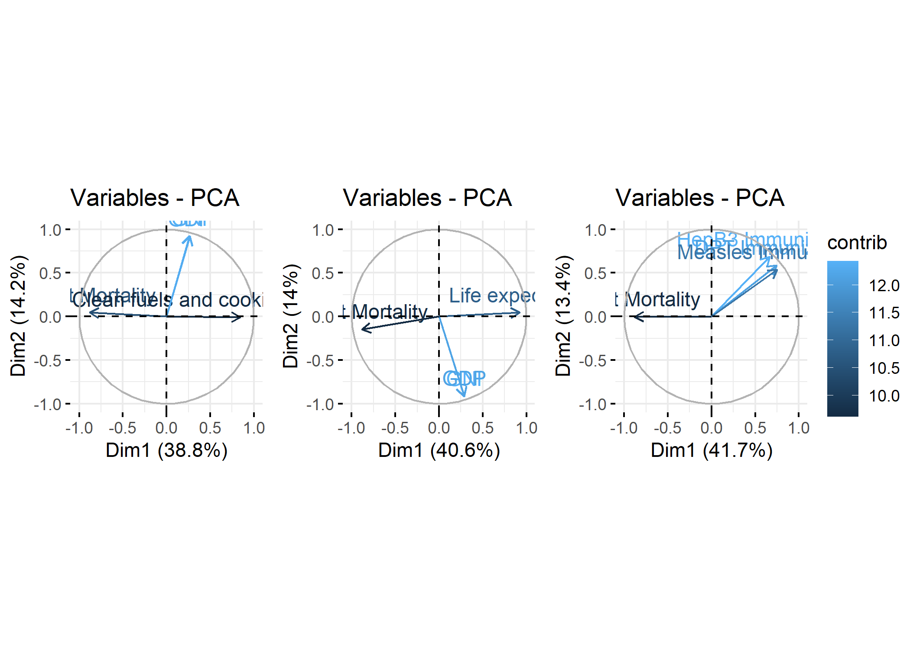<!-- -->

``` r
# biplot
plot_list2 <- list()

for (i in 1:3) {
  pca_result <- pca_results[[paste0("rand_", i, "_pca")]]
  
  plot2 <- ggbiplot(pca_result, 
                   scale = 0,
                   groups = as.factor(led$continent),
                   color = as.factor(led$continent),
                   ellipse = TRUE, 
                   alpha = 0.2,
                   palette = viridis::viridis_pal()) +
    theme_minimal() +
    ggtitle(paste("Biplot for rand_", i, "_pca"))
  
  plot_list2[[paste0("plot_", i)]] <- plot2
}

combined_plot2 <- ggarrange(plotlist = plot_list2, ncol = 3, common.legend = TRUE, legend = "bottom",
                            widths = rep(1, 3), heights = rep(1, 3)) + 
  theme(legend.position = "bottom") + 
  labs(title = "Random Biplots")

print(combined_plot2)
```

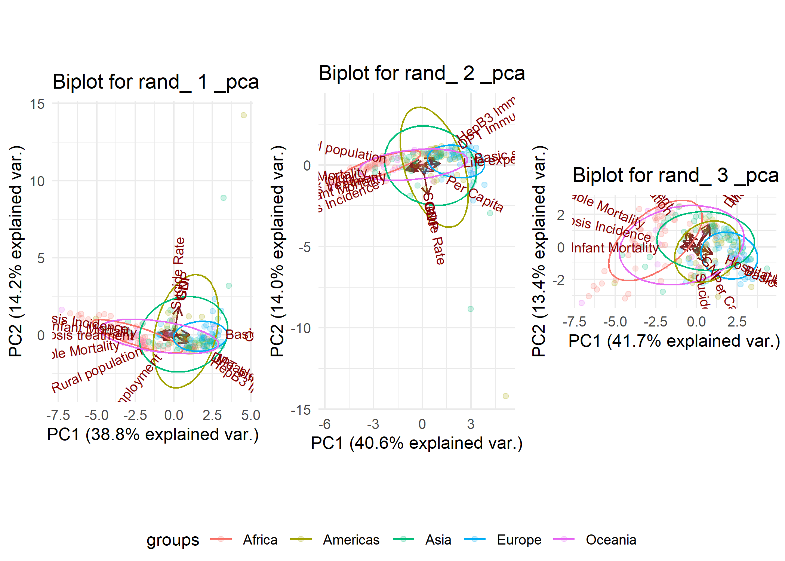<!-- -->
P.S. решение объединить 3 графика в один для biplots скорее плохое, я
пыталась их отмасштабировать и сделать общий заголовок, но не слишком
успешно( ~~мне просто хотелось потренироваться соединять графики в один
output)~~.
